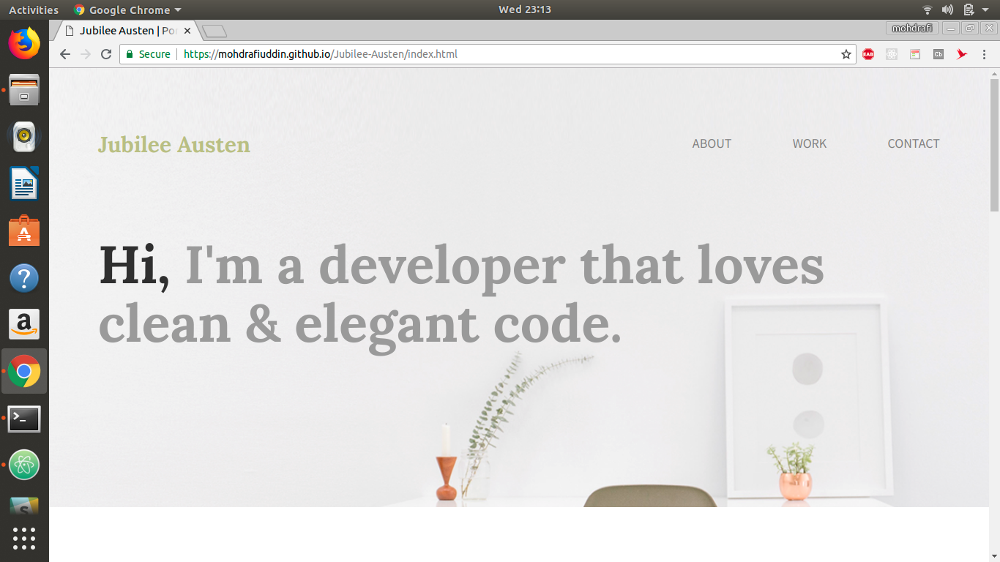

# Jubilee-Austen - A Simple Portfolio Website

[](https://mohdrafiuddin.github.io/Jubilee-Austen/index.html)
### >>> [Click Here For Demo.](https://mohdrafiuddin.github.io/Jubilee-Austen/index.html) <<<
[](https://mohdrafiuddin.github.io/Jubilee-Austen/index.html)
### Getting Started
>There are two methods for getting started with this repo.
#### Familiar with Git?  
> follow this steps to clone this repository using git.
```sh
$ git clone https://github.com/MohdRafiUddin/Jubilee-Austen.git
$ cd Jubilee-Austen
```
#### Not Familiar with Git?
> Click [here](https://github.com/MohdRafiUddin/Jubilee-Austen/archive/master.zip) then download the .zip file. Extract the contents of the zip file, then open your terminal, change to the project directory
